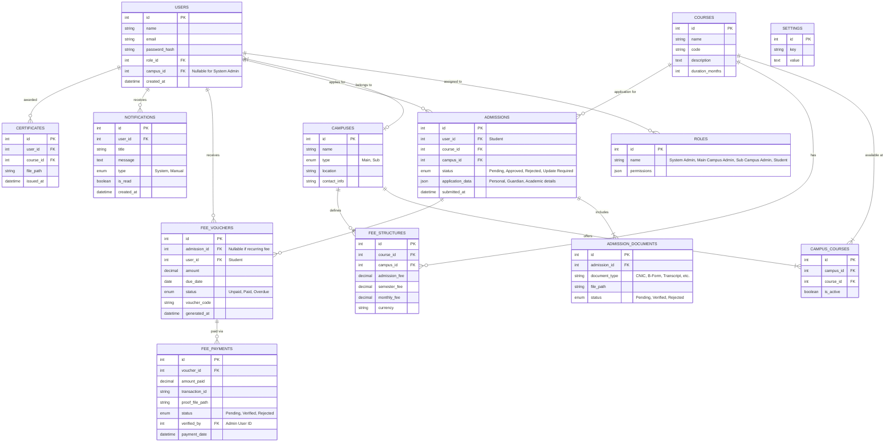

# ERD Diagrams

## High-Level Entity Relationship Diagram

```mermaid
erDiagram
    USERS ||--o{ ROLES : "assigned to"
    USERS }|--o| CAMPUSES : "belongs to"
    CAMPUSES ||--|{ CAMPUS_COURSES : "offers"
    COURSES ||--|{ CAMPUS_COURSES : "available at"
    COURSES ||--o{ FEE_STRUCTURES : "has"
    CAMPUSES ||--o{ FEE_STRUCTURES : "defines"
    USERS ||--o{ ADMISSIONS : "applies for"
    COURSES ||--o{ ADMISSIONS : "application for"
    ADMISSIONS ||--|{ ADMISSION_DOCUMENTS : "includes"
    ADMISSIONS ||--o{ FEE_VOUCHERS : "generates"
    USERS ||--o{ FEE_VOUCHERS : "receives"
    FEE_VOUCHERS ||--o{ FEE_PAYMENTS : "paid via"
    USERS ||--o{ NOTIFICATIONS : "receives"
    USERS ||--o{ CERTIFICATES : "awarded"

    USERS {
        int id PK
        string name
        string email
        string password_hash
        int role_id FK
        int campus_id FK "Nullable for System Admin"
        datetime created_at
    }

    ROLES {
        int id PK
        string name "System Admin, Main Campus Admin, Sub Campus Admin, Student"
        json permissions
    }

    CAMPUSES {
        int id PK
        string name
        enum type "Main, Sub"
        string location
        string contact_info
    }

    COURSES {
        int id PK
        string name
        string code
        text description
        int duration_months
    }

    CAMPUS_COURSES {
        int id PK
        int campus_id FK
        int course_id FK
        boolean is_active
    }

    FEE_STRUCTURES {
        int id PK
        int course_id FK
        int campus_id FK
        decimal admission_fee
        decimal semester_fee
        decimal monthly_fee
        string currency
    }

    ADMISSIONS {
        int id PK
        int user_id FK "Student"
        int course_id FK
        int campus_id FK
        enum status "Pending, Approved, Rejected, Update Required"
        json application_data "Personal, Guardian, Academic details"
        datetime submitted_at
    }

    ADMISSION_DOCUMENTS {
        int id PK
        int admission_id FK
        string document_type "CNIC, B-Form, Transcript, etc."
        string file_path
        enum status "Pending, Verified, Rejected"
    }

    FEE_VOUCHERS {
        int id PK
        int admission_id FK "Nullable if recurring fee"
        int user_id FK "Student"
        decimal amount
        date due_date
        enum status "Unpaid, Paid, Overdue"
        string voucher_code
        datetime generated_at
    }

    FEE_PAYMENTS {
        int id PK
        int voucher_id FK
        decimal amount_paid
        string transaction_id
        string proof_file_path
        enum status "Pending, Verified, Rejected"
        int verified_by FK "Admin User ID"
        datetime payment_date
    }

    NOTIFICATIONS {
        int id PK
        int user_id FK
        string title
        text message
        enum type "System, Manual"
        boolean is_read
        datetime created_at
    }

    CERTIFICATES {
        int id PK
        int user_id FK
        int course_id FK
        string file_path
        datetime issued_at
    }

    SETTINGS {
        int id PK
        string key
        text value
    }
```
