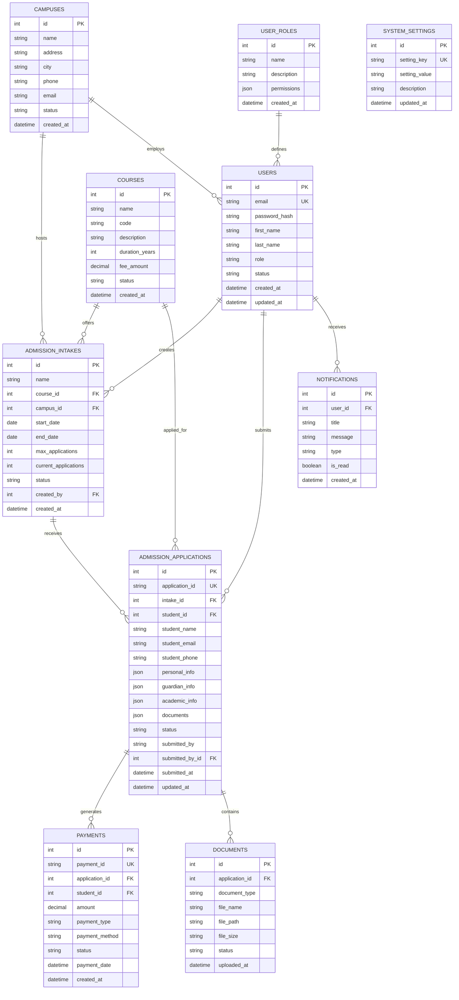

# ITHM CMS - Database Schema

## Entity Relationship Diagram



## Table Definitions

### Users Table
```sql
CREATE TABLE users (
    id INT PRIMARY KEY AUTO_INCREMENT,
    email VARCHAR(255) UNIQUE NOT NULL,
    password_hash VARCHAR(255) NOT NULL,
    first_name VARCHAR(100) NOT NULL,
    last_name VARCHAR(100) NOT NULL,
    role ENUM('super_admin', 'admin', 'accounts', 'teacher', 'student') NOT NULL,
    status ENUM('active', 'inactive', 'suspended') DEFAULT 'active',
    campus_id INT,
    created_at TIMESTAMP DEFAULT CURRENT_TIMESTAMP,
    updated_at TIMESTAMP DEFAULT CURRENT_TIMESTAMP ON UPDATE CURRENT_TIMESTAMP,
    FOREIGN KEY (campus_id) REFERENCES campuses(id)
);
```

### Campuses Table
```sql
CREATE TABLE campuses (
    id INT PRIMARY KEY AUTO_INCREMENT,
    name VARCHAR(255) NOT NULL,
    address TEXT,
    city VARCHAR(100),
    phone VARCHAR(20),
    email VARCHAR(255),
    status ENUM('active', 'inactive') DEFAULT 'active',
    created_at TIMESTAMP DEFAULT CURRENT_TIMESTAMP
);
```

### Courses Table
```sql
CREATE TABLE courses (
    id INT PRIMARY KEY AUTO_INCREMENT,
    name VARCHAR(255) NOT NULL,
    code VARCHAR(20) UNIQUE NOT NULL,
    description TEXT,
    duration_years INT DEFAULT 2,
    fee_amount DECIMAL(10,2) NOT NULL,
    status ENUM('active', 'inactive') DEFAULT 'active',
    created_at TIMESTAMP DEFAULT CURRENT_TIMESTAMP
);
```

### Admission Intakes Table
```sql
CREATE TABLE admission_intakes (
    id INT PRIMARY KEY AUTO_INCREMENT,
    name VARCHAR(255) NOT NULL,
    course_id INT NOT NULL,
    campus_id INT NOT NULL,
    start_date DATE NOT NULL,
    end_date DATE NOT NULL,
    max_applications INT DEFAULT 100,
    current_applications INT DEFAULT 0,
    status ENUM('active', 'inactive', 'closed') DEFAULT 'active',
    created_by INT NOT NULL,
    created_at TIMESTAMP DEFAULT CURRENT_TIMESTAMP,
    FOREIGN KEY (course_id) REFERENCES courses(id),
    FOREIGN KEY (campus_id) REFERENCES campuses(id),
    FOREIGN KEY (created_by) REFERENCES users(id)
);
```

### Admission Applications Table
```sql
CREATE TABLE admission_applications (
    id INT PRIMARY KEY AUTO_INCREMENT,
    application_id VARCHAR(50) UNIQUE NOT NULL,
    intake_id INT NOT NULL,
    student_id INT,
    student_name VARCHAR(255) NOT NULL,
    student_email VARCHAR(255) NOT NULL,
    student_phone VARCHAR(20),
    personal_info JSON,
    guardian_info JSON,
    academic_info JSON,
    documents JSON,
    status ENUM('draft', 'pending_review', 'under_review', 'accepted', 'rejected', 'onboarded') DEFAULT 'draft',
    submitted_by ENUM('student', 'admin') DEFAULT 'student',
    submitted_by_id INT,
    submitted_at TIMESTAMP NULL,
    updated_at TIMESTAMP DEFAULT CURRENT_TIMESTAMP ON UPDATE CURRENT_TIMESTAMP,
    FOREIGN KEY (intake_id) REFERENCES admission_intakes(id),
    FOREIGN KEY (student_id) REFERENCES users(id),
    FOREIGN KEY (submitted_by_id) REFERENCES users(id)
);
```

### Payments Table
```sql
CREATE TABLE payments (
    id INT PRIMARY KEY AUTO_INCREMENT,
    payment_id VARCHAR(50) UNIQUE NOT NULL,
    application_id INT NOT NULL,
    student_id INT NOT NULL,
    amount DECIMAL(10,2) NOT NULL,
    payment_type ENUM('admission_fee', 'tuition_fee', 'late_fee', 'other') NOT NULL,
    payment_method ENUM('cash', 'bank_transfer', 'online', 'cheque') NOT NULL,
    status ENUM('pending', 'completed', 'failed', 'refunded') DEFAULT 'pending',
    payment_date TIMESTAMP NULL,
    created_at TIMESTAMP DEFAULT CURRENT_TIMESTAMP,
    FOREIGN KEY (application_id) REFERENCES admission_applications(id),
    FOREIGN KEY (student_id) REFERENCES users(id)
);
```

### Documents Table
```sql
CREATE TABLE documents (
    id INT PRIMARY KEY AUTO_INCREMENT,
    application_id INT NOT NULL,
    document_type ENUM('passport_photo', 'matric_certificate', 'intermediate_certificate', 'cnic', 'other') NOT NULL,
    file_name VARCHAR(255) NOT NULL,
    file_path VARCHAR(500) NOT NULL,
    file_size INT,
    status ENUM('uploaded', 'verified', 'rejected') DEFAULT 'uploaded',
    uploaded_at TIMESTAMP DEFAULT CURRENT_TIMESTAMP,
    FOREIGN KEY (application_id) REFERENCES admission_applications(id)
);
```

### Notifications Table
```sql
CREATE TABLE notifications (
    id INT PRIMARY KEY AUTO_INCREMENT,
    user_id INT NOT NULL,
    title VARCHAR(255) NOT NULL,
    message TEXT NOT NULL,
    type ENUM('info', 'success', 'warning', 'error') DEFAULT 'info',
    is_read BOOLEAN DEFAULT FALSE,
    created_at TIMESTAMP DEFAULT CURRENT_TIMESTAMP,
    FOREIGN KEY (user_id) REFERENCES users(id)
);
```

### User Roles Table
```sql
CREATE TABLE user_roles (
    id INT PRIMARY KEY AUTO_INCREMENT,
    name VARCHAR(100) UNIQUE NOT NULL,
    description TEXT,
    permissions JSON,
    created_at TIMESTAMP DEFAULT CURRENT_TIMESTAMP
);
```

### System Settings Table
```sql
CREATE TABLE system_settings (
    id INT PRIMARY KEY AUTO_INCREMENT,
    setting_key VARCHAR(100) UNIQUE NOT NULL,
    setting_value TEXT,
    description TEXT,
    updated_at TIMESTAMP DEFAULT CURRENT_TIMESTAMP ON UPDATE CURRENT_TIMESTAMP
);
```

## Data Relationships

### One-to-Many Relationships
- **Users → Admission Intakes**: One user can create many intakes
- **Users → Applications**: One user can submit many applications
- **Campuses → Intakes**: One campus can have many intakes
- **Courses → Intakes**: One course can have many intakes
- **Intakes → Applications**: One intake can receive many applications
- **Applications → Payments**: One application can have many payments
- **Applications → Documents**: One application can have many documents
- **Users → Notifications**: One user can receive many notifications

### Many-to-Many Relationships
- **Users ↔ Campuses**: Users can be associated with multiple campuses
- **Users ↔ Roles**: Users can have multiple roles (future enhancement)

## Indexes for Performance

```sql
-- User indexes
CREATE INDEX idx_users_email ON users(email);
CREATE INDEX idx_users_role ON users(role);
CREATE INDEX idx_users_status ON users(status);

-- Application indexes
CREATE INDEX idx_applications_status ON admission_applications(status);
CREATE INDEX idx_applications_submitted_at ON admission_applications(submitted_at);
CREATE INDEX idx_applications_intake_id ON admission_applications(intake_id);

-- Payment indexes
CREATE INDEX idx_payments_status ON payments(status);
CREATE INDEX idx_payments_payment_date ON payments(payment_date);
CREATE INDEX idx_payments_student_id ON payments(student_id);

-- Document indexes
CREATE INDEX idx_documents_type ON documents(document_type);
CREATE INDEX idx_documents_status ON documents(status);

-- Notification indexes
CREATE INDEX idx_notifications_user_id ON notifications(user_id);
CREATE INDEX idx_notifications_is_read ON notifications(is_read);
CREATE INDEX idx_notifications_created_at ON notifications(created_at);
```

## Sample Data Structure

### Users Sample Data
```json
{
  "users": [
    {
      "id": 1,
      "email": "super@ithm.edu.pk",
      "first_name": "Dr. Muhammad",
      "last_name": "Ali Khan",
      "role": "super_admin",
      "status": "active"
    },
    {
      "id": 2,
      "email": "admin.lahore@ithm.edu.pk",
      "first_name": "Prof. Ahmed",
      "last_name": "Hassan",
      "role": "admin",
      "campus_id": 1,
      "status": "active"
    }
  ]
}
```

### Applications Sample Data
```json
{
  "admission_applications": [
    {
      "id": 1,
      "application_id": "ADM2024001",
      "intake_id": 1,
      "student_name": "Ahmed Ali Khan",
      "student_email": "ahmed.ali@email.com",
      "status": "pending_review",
      "personal_info": {
        "full_name": "Ahmed Ali Khan",
        "cnic": "12345-1234567-1",
        "date_of_birth": "2000-01-15",
        "gender": "Male"
      },
      "academic_info": {
        "matric_marks": 850,
        "matric_total": 1100,
        "intermediate_marks": 750,
        "intermediate_total": 1100
      }
    }
  ]
}
```

## Database Views

### Application Summary View
```sql
CREATE VIEW application_summary AS
SELECT 
    aa.application_id,
    aa.student_name,
    aa.student_email,
    aa.status,
    ai.name as intake_name,
    c.name as course_name,
    camp.name as campus_name,
    aa.submitted_at
FROM admission_applications aa
JOIN admission_intakes ai ON aa.intake_id = ai.id
JOIN courses c ON ai.course_id = c.id
JOIN campuses camp ON ai.campus_id = camp.id;
```

### Payment Summary View
```sql
CREATE VIEW payment_summary AS
SELECT 
    p.payment_id,
    p.amount,
    p.payment_type,
    p.status,
    aa.student_name,
    aa.application_id,
    p.payment_date
FROM payments p
JOIN admission_applications aa ON p.application_id = aa.id;
```

## Backup and Recovery

### Backup Strategy
```sql
-- Full database backup
mysqldump -u username -p ithm_cms > backup_$(date +%Y%m%d_%H%M%S).sql

-- Incremental backup (binary logs)
mysqlbinlog --start-datetime="2024-01-01 00:00:00" mysql-bin.000001 > incremental_backup.sql
```

### Recovery Procedures
```sql
-- Restore from full backup
mysql -u username -p ithm_cms < backup_20240101_120000.sql

-- Point-in-time recovery
mysqlbinlog --start-datetime="2024-01-01 10:00:00" --stop-datetime="2024-01-01 11:00:00" mysql-bin.000001 | mysql -u username -p
```

---

*This database schema document provides a comprehensive overview of the ITHM CMS database structure, relationships, and implementation details for production deployment.*
