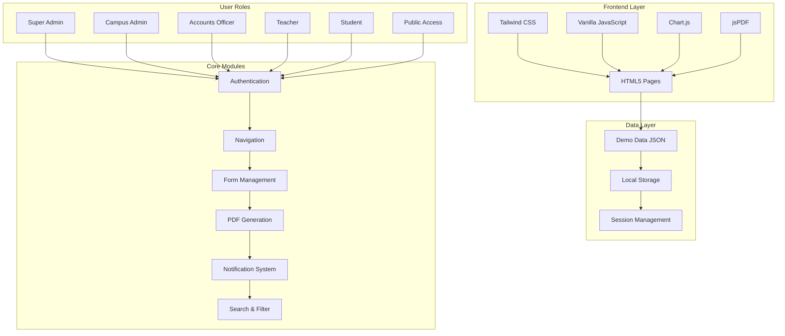
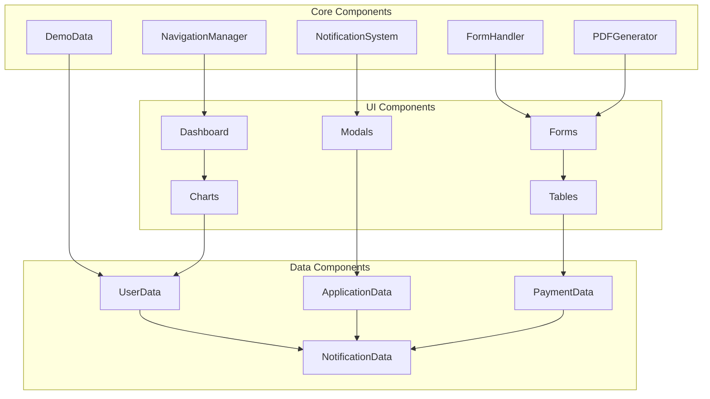
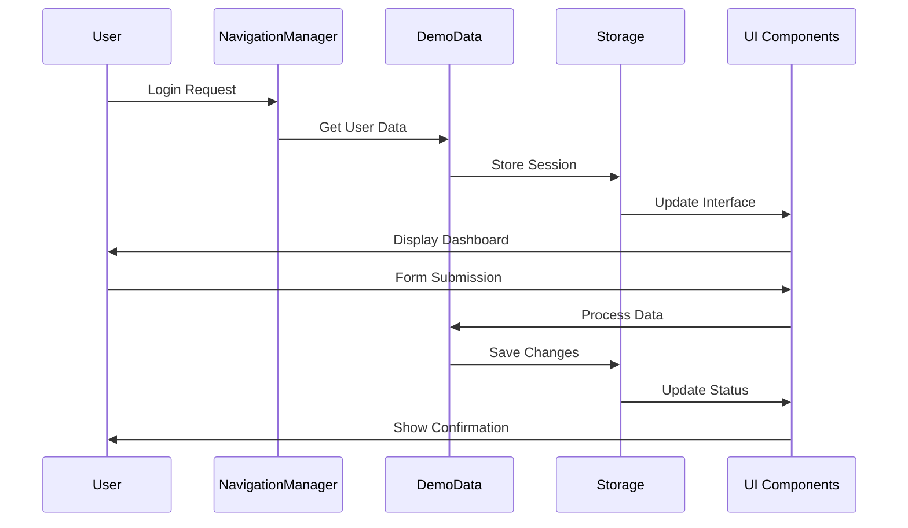
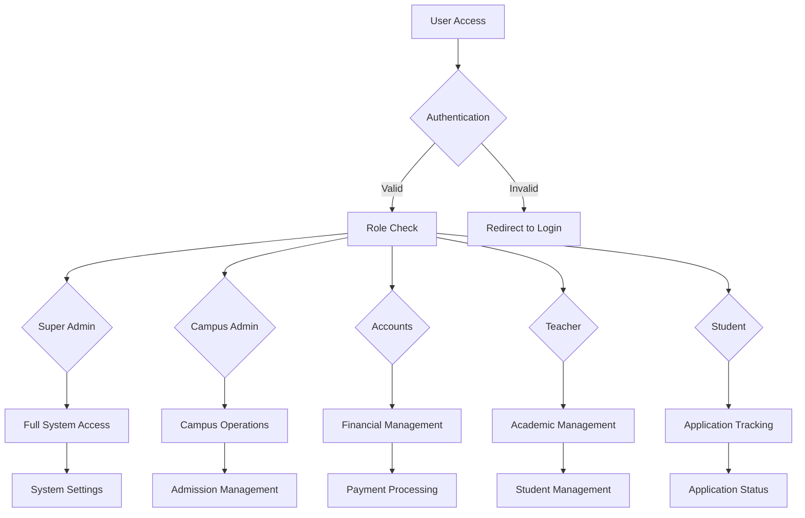
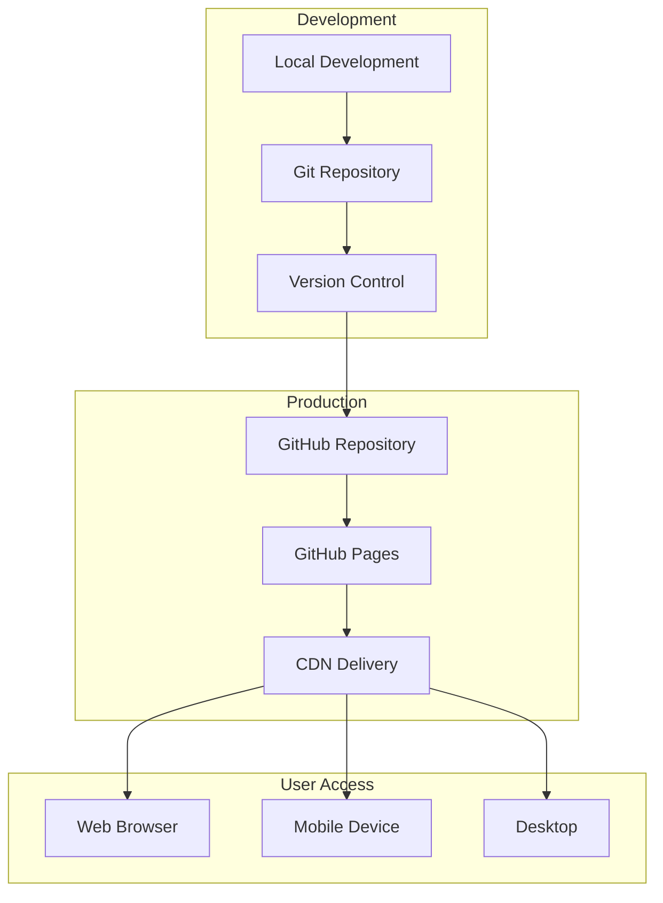

# ITHM CMS - Technical Architecture

## System Overview



## File Structure

```
ithm-mvp/
├── index.html                          # Landing page
├── admission-form.html                 # Student application form
├── assets/
│   ├── css/
│   │   └── tailwind-built.css         # Custom Tailwind components
│   └── js/
│       ├── demo-data.js               # Demo data and functions
│       └── navigation.js              # Navigation and auth
├── auth/                               # Authentication pages
│   ├── login.html
│   ├── register.html
│   └── forgot-password.html
├── super-admin/                       # Super Admin module
│   ├── dashboard.html
│   ├── application-detail.html
│   ├── reports.html
│   └── settings.html
├── admin/                             # Campus Admin module
│   ├── dashboard.html
│   ├── admission-management.html
│   └── user-management.html
├── accounts/                          # Accounts module
│   ├── dashboard.html
│   └── payment-detail.html
├── teacher/                           # Teacher module
│   └── dashboard.html
├── student/                           # Student module
│   └── dashboard.html
└── .diagrams/                         # Documentation
    ├── user-flows.md
    └── technical-architecture.md
```

## Technology Stack

### Frontend Technologies
- **HTML5**: Semantic markup and structure
- **Tailwind CSS**: Utility-first CSS framework
- **Vanilla JavaScript**: No frameworks, pure JS
- **Chart.js**: Data visualization library
- **jsPDF**: PDF generation library
- **Heroicons**: SVG icon library

### Data Management
- **JSON**: Demo data storage
- **Local Storage**: Session and user data
- **FormData API**: Form handling
- **FileReader API**: File upload handling

### Browser APIs
- **Canvas API**: Chart rendering
- **File API**: Document uploads
- **Storage API**: Data persistence
- **History API**: Navigation management

## Component Architecture



## Data Flow



## Security Model



## Performance Optimizations

### Frontend Optimizations
- **CDN Resources**: Tailwind CSS and Chart.js from CDN
- **Lazy Loading**: Images and heavy components
- **Minimal JavaScript**: No unnecessary frameworks
- **Efficient DOM**: Minimal DOM manipulation
- **CSS Optimization**: Utility-first approach

### Data Optimizations
- **Local Storage**: Fast data access
- **JSON Structure**: Optimized data format
- **Caching**: Browser-level caching
- **Compression**: Minified assets

## Browser Compatibility

| Feature | Chrome | Firefox | Safari | Edge |
|---------|--------|---------|--------|------|
| HTML5 | ✅ | ✅ | ✅ | ✅ |
| CSS3 | ✅ | ✅ | ✅ | ✅ |
| ES6+ | ✅ | ✅ | ✅ | ✅ |
| Local Storage | ✅ | ✅ | ✅ | ✅ |
| File API | ✅ | ✅ | ✅ | ✅ |
| Canvas API | ✅ | ✅ | ✅ | ✅ |

## Deployment Architecture



## API Integration Points

### Current (Demo Mode)
- **Local Storage**: User sessions and data
- **File System**: Document uploads
- **Browser APIs**: Native functionality

### Future (Production Mode)
- **REST API**: Backend integration
- **Database**: Persistent storage
- **Authentication**: JWT tokens
- **File Storage**: Cloud storage
- **Email Service**: Notifications

## Scalability Considerations

### Current Architecture
- **Static Files**: Fast loading
- **Client-Side**: Reduced server load
- **CDN Ready**: Global distribution
- **Mobile Optimized**: Responsive design

### Future Enhancements
- **Microservices**: Modular backend
- **Database**: PostgreSQL/MySQL
- **Caching**: Redis implementation
- **Load Balancing**: Multiple servers
- **Monitoring**: Application insights

## Maintenance & Updates

### Code Organization
- **Modular Structure**: Separated concerns
- **Documentation**: Comprehensive comments
- **Version Control**: Git-based workflow
- **Testing**: Manual testing procedures

### Update Process
1. **Development**: Local changes
2. **Testing**: Validation and QA
3. **Commit**: Git version control
4. **Deploy**: GitHub Pages update
5. **Monitor**: Performance tracking

---

*This technical architecture document provides a comprehensive overview of the ITHM CMS system structure, technologies, and implementation details.*
