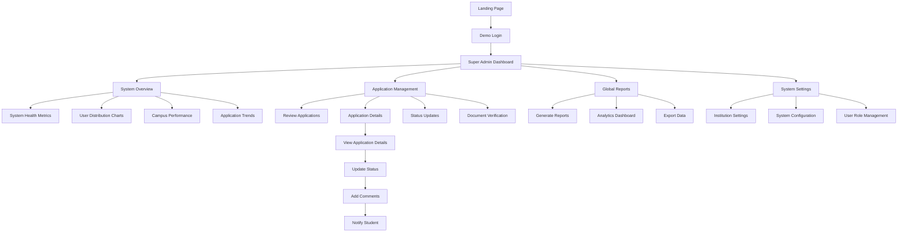
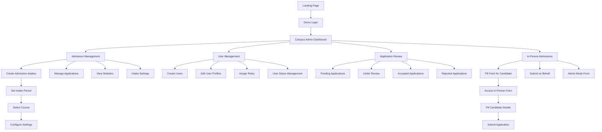
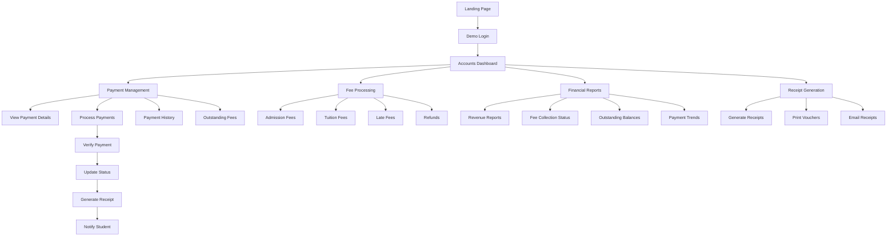
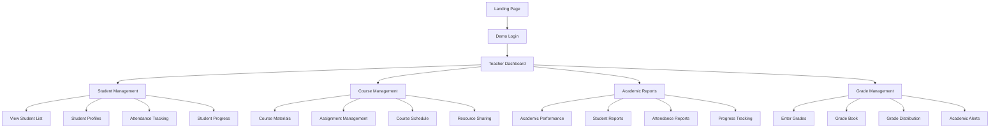
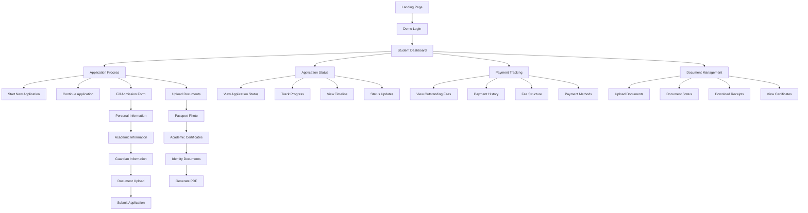
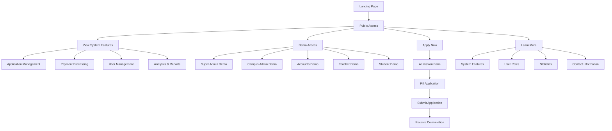
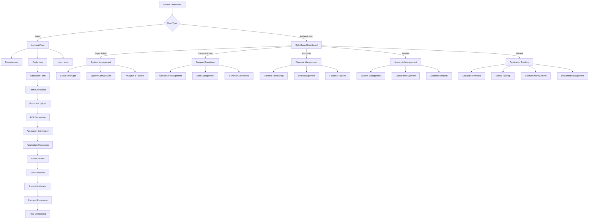

# ITHM CMS - User Role Flows

## Overview
This document outlines the complete user flows for each role in the ITHM College Management System.

---

## 1. Super Admin Flow



### Super Admin Capabilities:
- **System-wide oversight** and monitoring
- **Global application management** across all campuses
- **Comprehensive reporting** and analytics
- **System configuration** and settings
- **User role management** and permissions

---

## 2. Campus Admin Flow



### Campus Admin Capabilities:
- **Campus-specific** application management
- **Admission intake** creation and management
- **User management** for campus staff
- **In-person admission** assistance
- **Application review** and processing

---

## 3. Accounts Officer Flow



### Accounts Officer Capabilities:
- **Payment processing** and verification
- **Fee management** across all programs
- **Financial reporting** and analytics
- **Receipt generation** and distribution
- **Outstanding balance** tracking

---

## 4. Teacher Flow



### Teacher Capabilities:
- **Student management** and tracking
- **Course coordination** and materials
- **Academic reporting** and analytics
- **Grade management** and assessment
- **Student progress** monitoring

---

## 5. Student Flow



### Student Capabilities:
- **Complete application** process
- **Real-time status** tracking
- **Payment management** and history
- **Document upload** and management
- **Progress monitoring** and updates

---

## 6. Public Access Flow



### Public Access Capabilities:
- **System overview** and features
- **Demo access** for all roles
- **Direct application** submission
- **Information** about the system
- **Contact** and support details

---

## 7. Complete System Flow



---

## Key Features by Role

### 🔐 **Authentication & Access**
- **Demo Login**: One-click access for all roles
- **Role-based Redirects**: Automatic routing to appropriate dashboards
- **Session Management**: Secure user sessions
- **Logout Functionality**: Clean session termination

### 📊 **Dashboard Features**
- **Real-time Data**: Live statistics and updates
- **Interactive Charts**: Visual data representation
- **Quick Actions**: Fast access to common tasks
- **Notification System**: Real-time alerts and updates

### 📋 **Application Management**
- **Complete Workflow**: From application to onboarding
- **Status Tracking**: Real-time progress monitoring
- **Document Management**: Upload, verify, and track documents
- **PDF Generation**: Professional form output
- **In-Person Support**: Admin assistance for candidates

### 💰 **Financial Management**
- **Payment Processing**: Secure transaction handling
- **Fee Management**: Comprehensive fee structure
- **Receipt Generation**: Professional payment documentation
- **Financial Reporting**: Detailed analytics and insights

### 👥 **User Management**
- **Role Assignment**: Flexible permission system
- **Profile Management**: Complete user information
- **Status Control**: Active/inactive user management
- **Search & Filter**: Advanced user discovery

### 📱 **Responsive Design**
- **Mobile-First**: Optimized for all devices
- **Touch-Friendly**: Intuitive mobile interactions
- **Cross-Platform**: Consistent experience across devices
- **Accessibility**: Inclusive design principles

---

## System Architecture

```
┌─────────────────────────────────────────────────────────────┐
│                    ITHM CMS System                         │
├─────────────────────────────────────────────────────────────┤
│  Frontend: HTML5 + Tailwind CSS + Vanilla JavaScript      │
│  Data: JSON-based Demo Data with Local Storage            │
│  PDF: jsPDF for Document Generation                       │
│  Charts: Chart.js for Data Visualization                  │
│  Icons: Heroicons for UI Elements                         │
└─────────────────────────────────────────────────────────────┘
```

---

## Deployment Information

- **Repository**: https://github.com/zapk13/ithm-cms.git
- **Branch**: main
- **Deployment**: GitHub Pages ready
- **Status**: Production ready
- **Last Updated**: October 2024

---

*This document provides a comprehensive overview of all user flows in the ITHM College Management System. Each role has been designed with specific capabilities and workflows to ensure efficient and effective management of college operations.*
